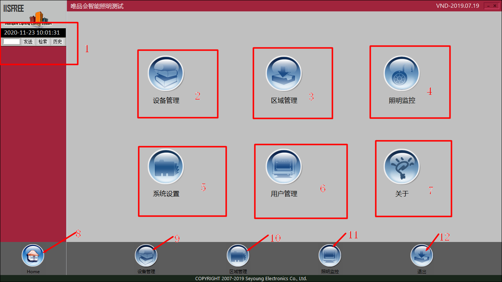

软件功能介绍
---                    

### 软件主界面

###### 主页面中常用功能简介
1. 文本框可输入场景指令，发送按钮完成指令发送，检索按钮可以检索指定场景号在数据库设备中存储的位置，历史按钮实现监控历史指令的调出。
2. 设备管理，完成不同类型设备的调试功能
3. 区域管理，实现对项目做区域划分。
4. 照明监控，可以设置对设备的控制，设备工作状态的回显指示。
5. 系统设置，对软件内置一些功能的开启。
6. 用户管理，对不同用户级别，权限的管理。
7. 关于
8. 主页按钮，返回主页面
9. 设备管理，同2
10. 区域管理，同3
11. 照明监控，同4
12. 退出。
