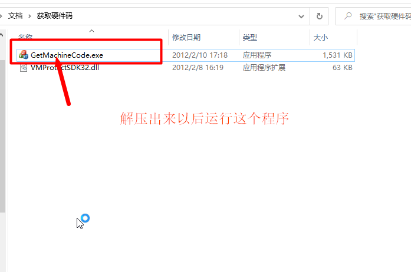
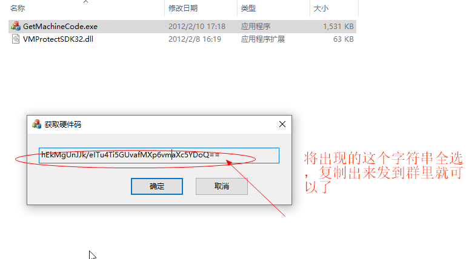
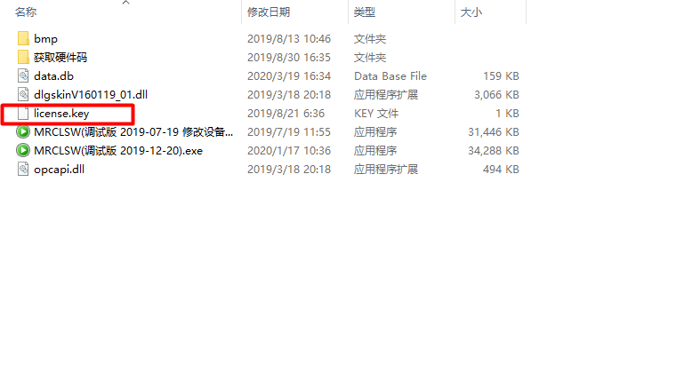
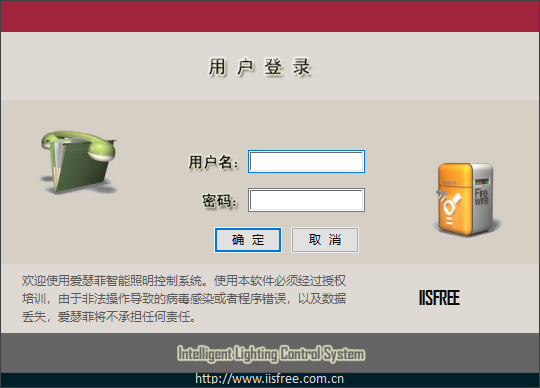

## 调试软件安装指导

#### 准备：
* 一台Windows系统的电脑
* [IISFREE监控软件](https://github.com/iisfree613/workInfo/tree/master/%E8%AE%BE%E5%A4%87%E8%B5%84%E6%96%99)
* [获取硬件码程序](https://github.com/iisfree613/workInfo/tree/master/%E8%AE%BE%E5%A4%87%E8%B5%84%E6%96%99)

#### 安装步骤：
1. 运行获取硬件码程序，成功后可以得到类似`zFZipJkAL9VWM8iOogy3nlaTtf4iKCms/jdN6/uVW6g=` 的一串字符

2. 将获取到的硬件码发于我司可以获取许可凭证。

3. 可以拿到的`license.key`文件放于调试软件同级目录下，即可正常运行。

